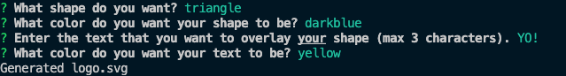
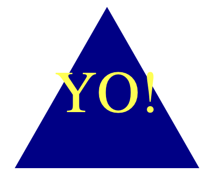

# Logo Generator

### DESCRIPTION

See below for application details, and for screenshots of example responses and the logo they generate; reference the YouTube link for a walkthrough demonstration of the application and its tests.

#### About the Application

This application was created so that freelance web developers could generate simple logos for their projects without having to pay a graphic designer to do so. After answering a series of prompts, the program will generate a circle, triangle, or square logo with a text overlay consisting of up to three-characters.

#### Screenshots

Example of required input responses:



Example of generated logo, based on example input responses above:



#### Links

Walkthrough Demo:
https://www.youtube.com/watch?v=i5uWCgjxsBQ

## Table of Contents

- [Installation](#installation)
- [Usage](#usage)
- [Credits](#credits)
- [License](#license)
- [Tests](#tests)
- [Contact](#contact)

## Installation

The Node.js runtime environment is required to run the contents of this application. You can download Node.js here:
https://nodejs.org/en

After installing Node.js, the application will still require Inquirer.js to run. To set this up, initialize a node package, and then install the appropriate version of Inquirer.js; open a terminal and run the following commands, sequentially...

```
npm init -y

npm install --save inquirer@^8.0.0
```

All code was checked and verified using Jest javascript testing. After completing the steps above, enter the following line of code in your terminal to set up testing capabilities...

```
npm install --save-dev jest
```

## Usage

<!-- step-by-step description of how to run the program -->

Follow these steps below to generate a custom logo.svg file...

1. Open a terminal
2. Type the following command:

```
node index.js
```

3. Use the arrow keys to select your shape: circle, triangle, or square
4. Type the color code OR hexidecimal number to specify your desired shape color
5. Type the text (maximum 3 characters) that you want to overlay your shape
6. Type the color code OR hexidecimal number to specify your desired text color

A confirmation, "Generated logo.svg" will log in the terminal, and a logo.svg file will be generated. This file contains the logo that matches your specifications.

For information on how to test the code, see [Tests](#tests) below.

## Credits

The developer utilized tutoring available through the University of Denver's Full-Stack Coding Boot Camp for portions of the code; all other code was scripted by the repository owner (see [Contact](#contact) below for details).

## License

N/A

## Tests

Tests can be run for all shapes; sample code blocks for testing are located in the shapes.test.js file in this repository. To run a test, open a terminal and run the following command:

```
npm run test
```

## Contact

GitHub Profile: https://github.com/ryantixier

Email: ryan.m.tixier@gmail.com
